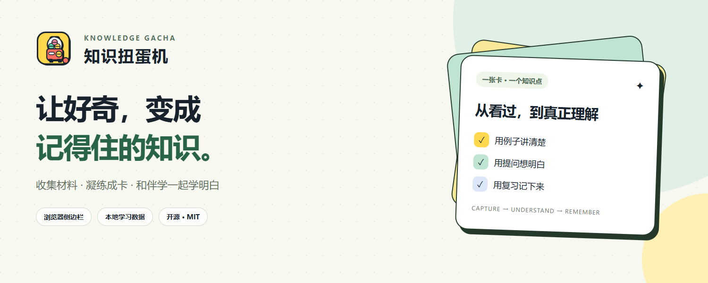
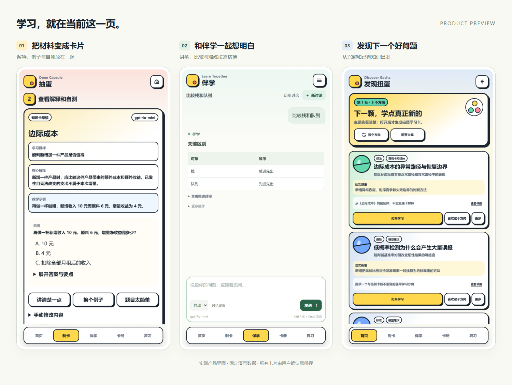
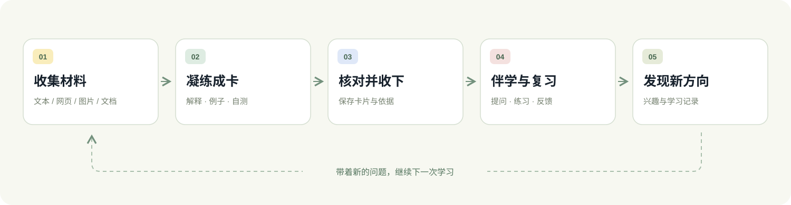

<p align="center">
  
</p>

<p align="center">把文章、笔记与截图，变成可以理解、讨论和复习的知识卡片。</p>

<p align="center">
  <a href="https://github.com/six486486/knowledge-gacha/releases/latest"></a>
  <a href="LICENSE"></a>
  
  
</p>

<p align="center">
  <a href="#quick-start">下载安装</a> ·
  <a href="#features">功能</a> ·
  <a href="#workflow">使用流程</a> ·
  <a href="docs/public/development.md">开发文档</a> ·
  <a href="https://github.com/six486486/knowledge-gacha/issues">反馈问题</a>
</p>

---

知识扭蛋机（Knowledge Gacha）是一个开源浏览器侧边栏学习工具。阅读时收集材料，凝练成卡；卡住时和伴学助手讨论，之后通过练习把知识记下来。学习数据保存在浏览器本地，生成内容使用你自己的模型服务。

<p align="center"></p>
<p align="center"><sub>截图来自隔离演示档案，使用固定模拟数据，不包含私人资料。</sub></p>
<p align="center">查看原尺寸：<a href="docs/assets/preview-input.png">素材输入</a> · <a href="docs/assets/preview-card.png">制卡</a> · <a href="docs/assets/preview-companion.png">伴学</a> · <a href="docs/assets/preview-discovery.png">发现</a></p>

<a id="features"></a>
## 把阅读接到学习上

| 能力 | 可以做什么 |
| --- | --- |
| **收集与制卡** | 从文本、网页选区、页面正文、截图、PDF 或 DOCX 提取材料，生成带解释、例子、自测和依据的卡片 |
| **长材料整理** | 拆分学习目标，勾选、排序、合并，再逐张生成与核对卡片 |
| **伴学助手** | 连续讨论，自动选择讲解、比较或陪练；可使用已有卡片与原文，支持历史、停止、恢复和引用查看 |
| **发现新知识** | 结合明确兴趣与学习记录生成具体候选，执行排除、去重和排序，支持喜欢或少推荐 |
| **复习与反馈** | 按到期时间练习，记录答案、提示、自评及错因，安排下一次复习 |
| **学习偏好** | 分开管理兴趣、内容难度和讲解方式；支持全局或主题范围，并显示作用说明 |
| **本地资料检索** | 使用随包提供的 BGE 中文模型和词法检索查找卡片与保留原文，可按位置回查引用 |

<a id="workflow"></a>
## 一个完整的学习循环



卡片在你确认收下后入册。伴学中的学习动作也由你点击执行；聊天中的“懂了”不会自动变成掌握记录。内容难度决定学多深，讲解方式决定怎么表达，复习结果则保留实际作答证据。

<a id="quick-start"></a>
## 下载与安装

1. 到 [Releases](https://github.com/six486486/knowledge-gacha/releases/latest) 下载 **`knowledge-gacha-1.0.2-extension.zip`**，解压到一个固定目录。
2. 打开 Edge 的 `edge://extensions` 或 Chrome 的 `chrome://extensions`，开启**开发者模式**。
3. 点击**加载解压缩的扩展**，选择解压后包含 `manifest.json` 的目录。
4. 打开知识扭蛋机侧边栏，进入 **更多 → 我的模型**，填写 Base URL、API Key 和模型名称，保存并测试。
5. 在**制卡**页投入一段材料，或直接打开**伴学**开始讨论。

发行包已包含本地解析器、检索模型和许可证，使用时无需安装 Node.js 或启动服务器。生成、模型核验和图片识别需要连接你配置的服务，并按该服务的规则计费。更新时解压新版本替换原扩展目录，再点击浏览器中的重新加载。

## 数据与隐私

- 学习数据保存在当前浏览器的本地 IndexedDB 中。
- API Key 由使用者自行配置，发行包与源码不附带任何人的 Key。默认会话保存，选择记住后本地持久保存。
- 本地检索模型不需要 API Key；生成服务会接收完成当前任务所需的材料和相关上下文。
- 伴学的知识库、学习偏好和学习记录可分别控制；偏好可以编辑、停用或删除。

具体存储方式、网络请求和清理入口见 [隐私说明](docs/public/privacy.md)。

## 本地开发

```bash
git clone https://github.com/six486486/knowledge-gacha.git
cd knowledge-gacha
npm ci
npm start
```

需要 Node.js **22.18+**。预览默认位于 `http://127.0.0.1:5173`；侧边栏与网页捕获通过加载 `extension/` 验证。

```bash
npm run check          # 文档、Skill、语法、单元与发布契约
npm run test:e2e       # 隔离浏览器与 Mock Provider
npm run package:release -- --out dist/release-NEW
```

参见 [开发与打包指南](docs/public/development.md)和 [架构概览](docs/public/architecture.md)。核心代码按前端、业务、存储/传输与 Agent 能力分层；未引入远程 Agent 服务或外部向量数据库。

## 当前边界

项目持续迭代中。自动化回归验证流程、权限、数据和恢复行为；模型生成的事实、题目与摘要仍需要核对。当前没有云同步、移动端或浏览器商店自动更新。浏览器兼容性、模型支持和本次验证结果以对应 Release 说明为准。

## 参与贡献

欢迎通过 [Issues](https://github.com/six486486/knowledge-gacha/issues) 提交反馈，通过 Pull Request 改进代码或文档。开始前请阅读 [贡献指南](CONTRIBUTING.md)。安全问题请参考 [安全报告说明](SECURITY.md)，不要在公开讨论中附带真实密钥或私人数据。

## 开源与致谢

项目自身代码采用 [MIT License](LICENSE)。PDF.js、Mammoth、Transformers.js、ONNX Runtime 与 BGE 等组件保留原许可证，详见 [第三方说明](THIRD_PARTY_NOTICES.md)。

README 的信息层次参考了 [Excalidraw](https://github.com/excalidraw/excalidraw) 与 [Immich](https://github.com/immich-app/immich)：简洁的品牌介绍、真实产品预览、清晰的功能与安装入口。这里的 Logo、说明图和界面素材属于本项目。
