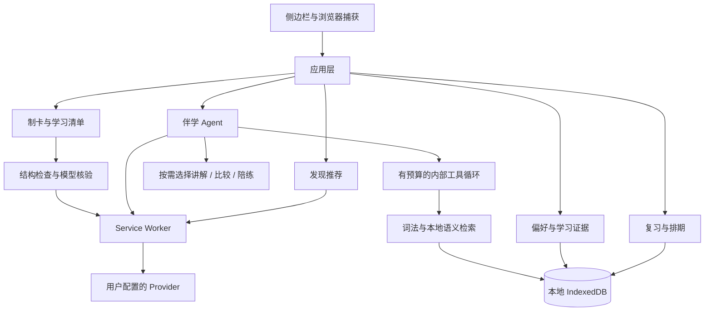

# 架构概览

这是一个纯 Manifest V3 侧边栏扩展。“后端”指扩展内的应用与业务模块，不是本机常驻服务。运行产品无需 Node 服务、外部数据库或服务器账户。

| 目录 | 职责 |
| --- | --- |
| `extension/src/frontend` | 页面、Markdown 展示、捕获、偏好和导入交互 |
| `extension/src/backend/application` | 组合制卡、检索、复习、记忆和伴学服务 |
| `extension/src/backend/features` | 制卡质量、发现排序、文档导入、复习规则等业务 |
| `extension/src/backend/infrastructure` | Provider 传输、存储、浏览器通信和解析 |
| `extension/src/harness` | Skills、工具执行、上下文管理、检索与学习记忆 |
| `extension/src/shared` | 跨模块数据结构和运行工具 |

伴学默认自动选择教学能力，也能手动固定。对话持久化，长期对话使用有预算的结构化摘要和最近完整问答；题目、阶段和提示次数独立保存。工具受参数、档案范围和调用预算限制，写入卡片与偏好由用户点击具体动作触发。

偏好、近期活动和实际复习证据分别保存。内容难度用于发现推荐、制卡和伴学；普通聊天不会自动变成已掌握记录。相同操作通过 mutationId 和事务避免重复写入。

RAG 使用本地 BGE Q8 向量和词法召回；引用保留来源、版本、位置与片段。检索失败可退回词法。引用匹配、格式核验和测试通过不能保证模型结论正确。
